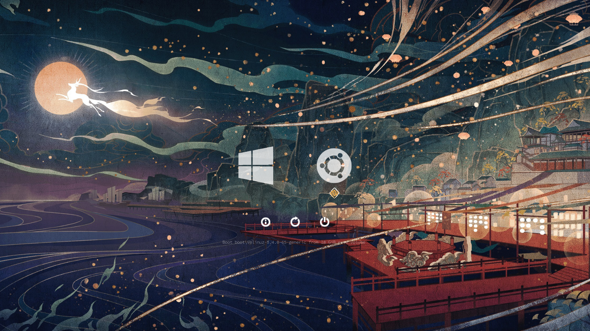
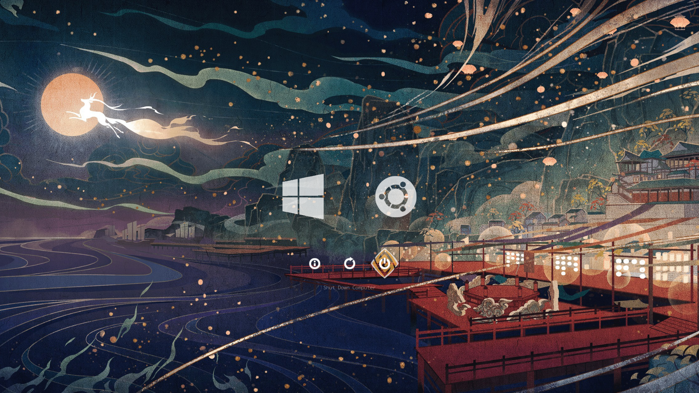

# Genshin Impact rEFInd Theme

Because Liyue Harbour is really pretty and Zhongli has no Mora




## Installation

1. Clone this repo  
   ```bash
   https://github.com/Wooniety/rEFInd-theme-Genshin-Impact
   ```
2. Remove unnecessary files i.e `.git` and `screenshots` folders
3. Figure out where your refind directory is. Mine was `/boot/efi/EFI/refind`
4. Create a folder named `themes`
5. Move 'rEFInd-theme-Genshin-Impact` into `themes`
6. Open `/boot/efi/EFI/refind/refind.conf`
7. Add `include themes/rEFInd-theme-Genshin-Impact/theme.conf` to the end of the file

## Attribution
OS icons from [refind-ambience](https://github.com/lukechilds/refind-ambience)  
Background from [Genshin Impact](https://twitter.com/GenshinImpact/status/1244565375875821568)